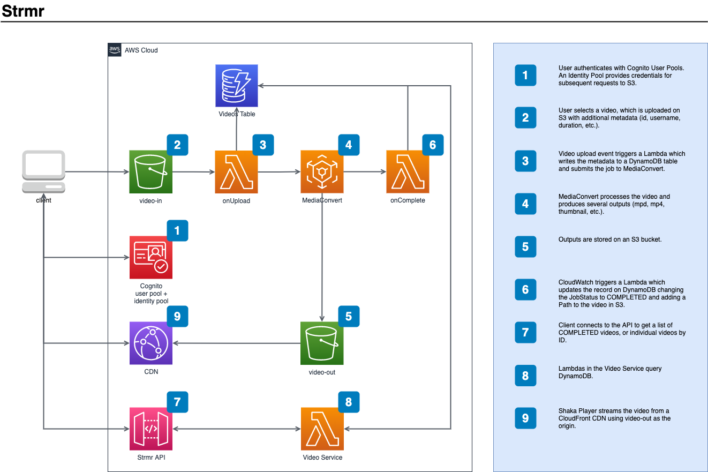

% Strmr: AWS Video On Demand
% Nicolo Maioli
% 24 September 2021

---
header-includes:
  - \hypersetup{colorlinks=false,
            allbordercolors={0 0 0},
            pdfborderstyle={/S/U/W 1}}
---

# `$ whoami`

**Nicolo Maioli AND Doomguy**

Full-time Developer, part-time pizza fiend

Talk to me about:

- AWS
- Terraform
- Serverless
- Go
- Linux
- Psychedelic Garage

Do *not* talk to me about:

- React
- IATA

# OK, Why Tho

- I was interested in AWS S3 for uploading and serving large files.
- I thought that video on demand was an interesting problem.
- I felt like the time had come to finally learn some React.

# Demo

*Disclaimer:* I'm not much of a FE developer so please be kind to my crappy UI.

[Let's do this!](http://localhost:3000)

# Architecture

# Challenges

- The AWS SDK v2 for Go - examples are sparse, often incomplete, and only
    cover trivial cases.
- Figuring out MediaConvert - documentation is sparse.
- Media files require a decent amount of domain knowledge.
- DynamoDB is still kicking my arse.
- Context switching.

# Resources

- [Dynamic Adaptive Streaming over HTTP](https://www.iso.org/standard/57623.html)
- [AWS Solutions: Video On Demand](https://www.youtube.com/watch?v=d-XCfp97pX0&t=173s)
- [Serverless: Hello World Go Example](https://www.serverless.com/framework/docs/providers/aws/examples/hello-world/go/)
- [DynamoDB, expressions and Go](https://antklim.medium.com/dynamodb-expressions-and-go-b8230c253e1f)
- [Create a poster frame and thumbnail images for videos using AWS Elemental MediaConvert](https://aws.amazon.com/blogs/media/create-a-poster-frame-and-thumbnail-images-for-videos-using-aws-elemental-mediaconvert/)

# Improvements

- Automatically update `.env` files for Serverless and React from Terraform.
- Validate media files onUpload.
- Add support for HLS.
- Tidy up the codebase.
- Automate deployments.

# Q&A

Raise your hand or use the chat, don't be shy!
